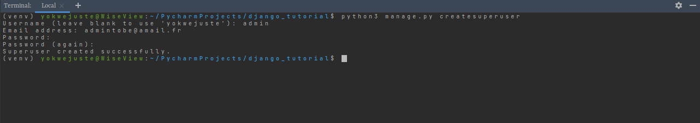

# HELLO WORLD!

#### Here is a new Django Tutorial for beginners, create an issue, watch me and follow me, for more info email me!

## <ins>What's django?</ins>
    Django is web development framework that assists in building and maintainning quality web applications. Django helps eliminate repetitive tasks making the 
    development process an easy and time saving experience. This tutorial gives a complete understanding of Django.     

##### As a beginner in Django some prerequisites are needed by the said student!

* HTML at the tips\
* CSS; if possible with a framework\
As for me, I use 
    * BOOTSTRAP 
    * TAILWIND 
    * ...mail may for better ones if so.
* Basic notions in OOP: control structures, data structures and variables, classes, objects and

* Javascript, which the most common language between programmers  
NO worry books will be provided for your learning.

### Feel free to offer me a coffee if satisfied with this repo content.  
###**Create a new directory where your django projects will lie.**

for example; \

 To install django, use the following commands:

### `pip install django`
### `pip install django-admin`

> To be franc, dude don't be exited, you just entered now another step in your python dev journey!

> I guess you were, 😂 feel free mehn just kiding! Coding is just done for fun.
Visualise it, capture the moment and reproduce.

## I want you to ask yourself a question now;

**Why do you want to program or code, what ever be its name?**

### <ins>To start a new app or just an app in your django newly created projects, run the command</ins>

**For Windows run by default**
###`python manage.py startapp app_name`
\
\
**For linux and macOS use this**
###`python3 manage.py startapp app_name`
\
\
This is the step where you check if your installations where successfully done. We simply do this with:
###`python manage.py runserver`

and to stop the server feel free to press `ctrl` + `c`

By default, django runs with the default address of **http://127.0.0.1:8000/**, keeping in mind that it can fully be \
customise. Below is an illustration of what it gives as output.

#### Let's move ahead customising our files writing our **Almighty `"HELLO WORLD!"` text**

* [Click Here](django_tutorial/settings.py) to view my `Settings.py` file.
* [Click Here](django_tutorial/urls.py) to view my main project `urls.py` file.
* [Click Here](part_one/models.py) to view my part_one app `models.py` file.
* [Click Here](part_one/admin.py) to view my part_one app `admin.py` file.
* [Click Here](part_one/urls.py) to view my part_one app `urls.py` file.
* [Click Here](part_one/urls.py) to view my part_one app `urls.py` file.
* [Click Here](part_one/templates) to view my app `templates` files file.
\
  \
  A link to my media folder Just [here](media)
  
By default the best file skeleton for a django project with one app is the diagram below;

\

##<ins>initialisation of the admin interface</ins>

`python3 manage.py createsuperuser`
where you will have some prompts;

Admin Name: `admin`\
Email: `admintobe@amail.fr` (**Not real just for fun**)\
Password: `django-github`

Browser result **http://127.0.0.1:8000/admin/**

On track? Let's move on!

## <ins>Get some tips</ins>

In the template folder in this repo, create as many html files as you want or 🤔 as necessary,